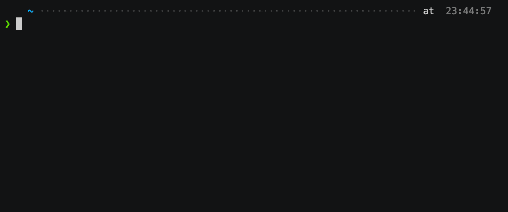

# pv-migrate

[](https://github.com/utkuozdemir/pv-migrate/actions/workflows/lint-build-test.yml)
[](https://coveralls.io/github/utkuozdemir/pv-migrate?branch=master)
[](https://goreportcard.com/report/github.com/utkuozdemir/pv-migrate)

[](https://github.com/utkuozdemir/pv-migrate/blob/master/LICENSE)

[](https://github.com/utkuozdemir/pv-migrate/network)
[](https://github.com/utkuozdemir/pv-migrate/issues)


`pv-migrate` is a CLI tool/kubectl plugin to easily migrate 
the contents of one Kubernetes `PersistentVolume[Claim]` to another.

## Demo



## Introduction

On Kubernetes, if you need to rename a resource (like a `Deployment`) or to move it to a different namespace, 
you can simply create a copy of its manifest with the new namespace and/or name and apply it.

However, it is not as simple with `PersistentVolumeClaim` resources: They are not only metadata,
but they also store data in the underlying storage backend.

In these cases, moving the data stored in the PVC can become a problem, making migrations more difficult.

## Use Cases

- **Case 1:** You have a database that has a PersistentVolumeClaim `db-data` of size `50Gi`.
Time shows that `50Gi` was not enough, and it filled all the disk space.  
And unfortunately, your StorageClass/provisioner doesn't support 
[volume expansion](https://kubernetes.io/blog/2018/07/12/resizing-persistent-volumes-using-kubernetes/).
Now you need to create a new PVC of `1Ti` and somehow copy all the data to the new volume, 
as-is, with its file ownership and permissions.  
Simply create the new PVC `db-data-v2`, and use `pv-migrate` to move data from `db-data` to `db-data-v2`.


- **Case 2:** You need to move PersistentVolumeClaim `my-pvc`  from namespace `ns-a` to namespace `ns-b`.  
Simply create the PVC with the same name and manifest in `ns-b` and use `pv-migrate` to clone its content.


- **Case 3:** You are moving from one cloud provider to another! Now you need to move the database 
from one Kubernetes cluster to the other.  
Both clusters have internet access and the source cluster supports `LoadBalancer` type services with public IPs.  
Just use `pv-migrate` to clone the data **securely over the internet**.

## Highlights

- Supports in-namespace, in-cluster as well as cross-cluster migrations
- Uses rsync over SSH with a freshly generated [Ed25519](https://en.wikipedia.org/wiki/EdDSA) 
  or RSA keys each time to securely migrate the files
- Allows specifying your own docker images for rsync and sshd
- Supports multiple migration strategies to do the migration efficiently and fallback to other strategies when needed
- Customizable strategy order
- Supports arm32v7 (Raspberry Pi etc.) and arm64 architectures as well as amd64

## Installation

### Using Homebrew (MacOS/Linux)
If you have homebrew, the installation is as simple as:
```bash
brew tap utkuozdemir/pv-migrate
brew install pv-migrate
```

### Using Scoop (Windows)
If you use [Scoop package manager](https://scoop.sh) on Windows, 
run the following commands in a command prompt (CMD/Powershell):
```powershell
scoop bucket add pv-migrate https://github.com/utkuozdemir/scoop-pv-migrate.git
scoop install pv-migrate/pv-migrate
```

### By downloading the binaries (MacOS/Linux/Windows)

1. Go to the [releases](https://github.com/utkuozdemir/pv-migrate/releases) and download 
   the latest release archive for your platform.
2. Extract the archive.
3. Move the binary to somewhere in your `PATH`.

Sample steps for MacOS:
```bash
$ VERSION=<VERSION_TAG>
$ wget https://github.com/utkuozdemir/pv-migrate/releases/download/v${VERSION}/pv-migrate_${VERSION}_darwin_x86_64.tar.gz
$ tar -xvzf pv-migrate_${VERSION}_darwin_x86_64.tar.gz
$ mv pv-migrate /usr/local/bin
$ pv-migrate --help
```

### Running directly in Docker container

Alternatively, you can use the 
[official Docker images](https://hub.docker.com/repository/docker/utkuozdemir/pv-migrate) 
that come with the `pv-migrate` binary pre-installed:
```bash
docker run --rm -it utkuozdemir/pv-migrate:<IMAGE_TAG> pv-migrate migrate ...
```

## Usage

Help command:
```
A command-line utility to migrate data from one Kubernetes PersistentVolumeClaim to another

Usage:
  pv-migrate [command]

Available Commands:
  completion  Generate the autocompletion script for the specified shell
  help        Help about any command
  migrate     Migrate data from one Kubernetes PersistentVolumeClaim to another

Flags:
  -h, --help                help for pv-migrate
      --log-format string   log format, must be one of: json, fancy (default "fancy")
      --log-level string    log level, must be one of: trace, debug, info, warn, error, fatal, panic (default "info")
  -v, --version             version for pv-migrate
```


Command `migrate`:
```
Migrate data from one Kubernetes PersistentVolumeClaim to another

Usage:
  pv-migrate migrate [flags]

Aliases:
  migrate, m

Flags:
  -C, --dest-context string            context in the kubeconfig file of the destination PVC
  -d, --dest-delete-extraneous-files   delete extraneous files on the destination by using rsync's '--delete' flag
  -K, --dest-kubeconfig string         path of the kubeconfig file of the destination PVC
  -N, --dest-namespace string          namespace of the destination PVC
  -P, --dest-path string               the filesystem path to migrate in the the destination PVC (default "/")
      --helm-set strings               set additional Helm values on the command line (can specify multiple or separate values with commas: key1=val1,key2=val2)
      --helm-set-file strings          set additional Helm values from respective files specified via the command line (can specify multiple or separate values with commas: key1=path1,key2=path2)
      --helm-set-string strings        set additional Helm STRING values on the command line (can specify multiple or separate values with commas: key1=val1,key2=val2)
  -f, --helm-values strings            set additional Helm values by a YAML file or a URL (can specify multiple)
  -h, --help                           help for migrate
  -i, --ignore-mounted                 do not fail if the source or destination PVC is mounted
  -o, --no-chown                       omit chown on rsync
  -b, --no-progress-bar                do not display a progress bar
  -c, --source-context string          context in the kubeconfig file of the source PVC
  -k, --source-kubeconfig string       path of the kubeconfig file of the source PVC
  -R, --source-mount-read-only         mount the source PVC in ReadOnly mode (default true)
  -n, --source-namespace string        namespace of the source PVC
  -p, --source-path string             the filesystem path to migrate in the the source PVC (default "/")
  -a, --ssh-key-algorithm string       ssh key algorithm to be used. Valid values are rsa,ed25519 (default "ed25519")
  -s, --strategies strings             the comma-separated list of strategies to be used in the given order (default [mnt2,svc,lbsvc])

Global Flags:
      --log-format string   log format, must be one of: json, fancy (default "fancy")
      --log-level string    log level, must be one of: trace, debug, info, warn, error, fatal, panic (default "info")
```

The Kubernetes resources created by pv-migrate are sourced from a [Helm chart](helm/pv-migrate).

You can pass raw values to the backing Helm chart 
using the `--helm-*` flags for further customization: container images, 
resources, serviceacccounts, additional annotations etc.

## Strategies

`pv-migrate` has multiple strategies implemented to carry out the migration operation. Those are the following:

| Name    | Description                                                                                                                                                                                                                                                                                                                                                                                                                                                                                                                                                                                                                                                             |
|---------|-------------------------------------------------------------------------------------------------------------------------------------------------------------------------------------------------------------------------------------------------------------------------------------------------------------------------------------------------------------------------------------------------------------------------------------------------------------------------------------------------------------------------------------------------------------------------------------------------------------------------------------------------------------------------|
| `mnt2`  | **Mount both** - Mounts both PVCs in a single pod and runs a regular rsync, without using SSH or the network. Only applicable if source and destination PVCs are in the same namespace and both can be mounted from a single pod.                                                                                                                                                                                                                                                                                                                                                                                                                                       |
| `svc`   | **Service** - Runs rsync+ssh over a Kubernetes Service (`ClusterIP`). Only applicable when source and destination PVCs are in the same Kubernetes cluster.                                                                                                                                                                                                                                                                                                                                                                                                                                                                                                              |
| `lbsvc` | **Load Balancer Service** - Runs rsync+ssh over a Kubernetes Service of type `LoadBalancer`. Always applicable (will fail if `LoadBalancer` IP is not assigned for a long period).                                                                                                                                                                                                                                                                                                                                                                                                                                                                                      |
| `local` | **Local Transfer** - Runs sshd on both source and destination, then uses a combination of `kubectl port-forward` logic and an SSH reverse proxy to tunnel all the traffic over the client device (the device which runs pv-migrate, e.g. your laptop). Requires `ssh` command to be available on the client device. <br/><br/>Note that this strategy is **experimental** (and not enabled by default), potentially can put heavy load on both apiservers and is not as resilient as others. It is recommended for small amounts of data and/or when the only access to both clusters seems to be through `kubectl` (e.g. for air-gapped clusters, on jump hosts etc.). |

## Examples

To migrate contents of PersistentVolumeClaim `small-pvc` in namespace `source-ns`
to the PersistentVolumeClaim `big-pvc` in namespace `dest-ns`, use the following command:

Minimal example, source and destination are in the currently selected namespace in the context:
```bash
$ pv-migrate migrate old-pvc new-pvc
```

Example with different namespaces:
```bash
$ pv-migrate migrate \
  --source-namespace source-ns \
  --dest-namespace dest-ns \
  old-pvc new-pvc
```

Between different clusters:
```bash
pv-migrate migrate \
  --source-kubeconfig /path/to/source/kubeconfig \
  --source-context some-context \
  --source-namespace source-ns \
  --dest-kubeconfig /path/to/dest/kubeconfig \
  --dest-context some-other-context \
  --dest-namespace dest-ns \
  --dest-delete-extraneous-files \
  old-pvc new-pvc
```

With custom rsync container image & sshd service account:
```bash
$ pv-migrate migrate \
  --helm-set rsync.image.repository=mycustomrepo/rsync \
  --helm-set rsync.image.tag=v42.0.0 \
  --helm-set sshd.serviceAccount.create=false \
  --helm-set sshd.serviceAccount.name=my-custom-sa \
  old-pvc new-pvc
```

**Note:** For it to run as kubectl plugin via `kubectl pv-migrate ...`, 
put the binary with name `kubectl-pv_migrate` under your `PATH`.


# Stargazers over time

[](https://starchart.cc/utkuozdemir/pv-migrate)


# Contributing

See [CONTRIBUTING](CONTRIBUTING.md) for details.
