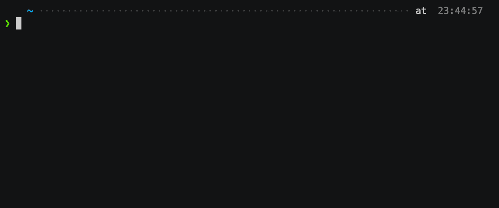

# pv-migrate

[](https://github.com/utkuozdemir/pv-migrate/actions/workflows/build.yml)
[](https://codecov.io/gh/utkuozdemir/pv-migrate)
[](https://goreportcard.com/report/github.com/utkuozdemir/pv-migrate)

[](https://github.com/utkuozdemir/pv-migrate/blob/main/LICENSE)

[](https://github.com/utkuozdemir/pv-migrate/network)
[](https://github.com/utkuozdemir/pv-migrate/issues)


`pv-migrate` is a CLI tool/kubectl plugin for moving Kubernetes
`PersistentVolumeClaim` data.

Its primary workflow is direct PVC-to-PVC migration, including in-namespace,
cross-namespace, and cross-cluster copies. It can also back up PVC data to
bucket storage and restore it later using S3-compatible storage, Azure Blob,
GCS, or a custom rclone remote.

---

> [!WARNING]
> Heads up: this is a side project I maintain in my spare time. I might take a long time to look at issues or PRs, or not get to them at all. Sorry in advance, and thanks for understanding.

---

## Demo



## Why this exists

On Kubernetes, renaming a resource like a `Deployment` is usually just a manifest change.
Create the same object with a new name or namespace, apply it, and move on.

PVCs are different. The Kubernetes object is only the metadata. The real data
lives in the storage backend.

`pv-migrate` moves that data. It can copy directly between PVCs, or use bucket
storage as a backup target or intermediate hop.

## Workflows

### PVC-to-PVC migration

Copy data directly from one PVC to another. This is the core pv-migrate workflow
and uses rsync-based strategies.

```bash
$ pv-migrate --source old-pvc --dest new-pvc
```

See [PVC-to-PVC migration](docs/migrate.md) for strategies and examples.

### Bucket backup and restore

Back up a PVC to object storage and restore it later. Use this for backups,
one-off exports, or moves where direct cluster-to-cluster connectivity is awkward.

```bash
$ pv-migrate backup \
  --source app-data \
  --backend s3 \
  --bucket pv-backups \
  --name app-data-2026-04-11

$ pv-migrate restore \
  --dest app-data-restore \
  --backend s3 \
  --bucket pv-backups \
  --name app-data-2026-04-11
```

See [bucket backup and restore](docs/backup-restore.md) for backend options, object layout,
raw rclone config mode, and permissions caveats.

## Use cases

:arrow_right: You have a database that has a PersistentVolumeClaim `db-data` of size `50Gi`.  
Your DB grew over time, and you need more space for it.  
You cannot resize the PVC because it doesn't support [volume expansion](https://kubernetes.io/blog/2018/07/12/resizing-persistent-volumes-using-kubernetes/).  
Create a new, bigger PVC `db-data-v2` and use `pv-migrate` to copy data from `db-data` to `db-data-v2`.


:arrow_right: You need to move PersistentVolumeClaim `my-pvc`  from namespace `ns-a` to namespace `ns-b`.  
Create the PVC with the same name and manifest in `ns-b` and use `pv-migrate` to copy its content.


:arrow_right: You are moving from one cloud provider to another, 
and you need to move the data from one Kubernetes cluster to the other.  
Just use `pv-migrate` to copy the data **securely over the internet**.

:arrow_right: You need to change the `StorageClass` of a volume, for instance,
from a `ReadWriteOnce` one (like `local-path`) to a `ReadWriteMany` like NFS.
As the `StorageClass` is not editable, you can use `pv-migrate` to transfer
the data from the old PVC to the new one with the desired `StorageClass`.

:arrow_right: You need to keep a PVC backup in object storage before a risky operation,
or to export PVC data out of the cluster for later restore.  
Use `pv-migrate backup` to copy the volume into S3-compatible storage, Azure Blob, or GCS,
then `pv-migrate restore` when you need the data back.

:arrow_right: You want scheduled PVC backups using Kubernetes-native building blocks.
Run `pv-migrate backup` from a `CronJob` and rely on bucket lifecycle rules or separate automation for retention.

:arrow_right: Direct cluster-to-cluster connectivity is awkward, blocked, or temporary.  
Back up the source PVC to a bucket, then restore from that bucket into the destination cluster.

## Highlights

- Supports in-namespace, in-cluster, and cross-cluster migrations
- Uses rsync over SSH with a freshly generated [Ed25519](https://en.wikipedia.org/wiki/EdDSA)
  or RSA key pair each time to securely migrate the files
- Supports backing up PVC data to and restoring it from S3-compatible, Azure Blob, or GCS bucket storage
- Supports custom rclone remotes for backup/restore backends
- Lets you override rendered manifests, including images, affinity, and other Helm values
- Supports multiple migration strategies and falls back when needed:
  - Mount both PVCs in a single pod (mount)
  - ClusterIP service (clusterip)
  - LoadBalancer service (loadbalancer)
  - NodePort service (nodeport, opt-in)
  - Local port-forward transfer (local, opt-in)
- Push mode (`--rsync-push`) for when the source side cannot expose a service, e.g., behind a firewall or NAT
- Detach mode (`--detach`) for large transfers, so the job can keep running after the CLI exits
- Customizable strategy order
- Supports arm32v7 (Raspberry Pi, etc.), arm64, and amd64
- Supports completion for popular shells: bash, zsh, fish, powershell

## Installation

See [docs/install.md](docs/install.md) for install options and shell completion setup.

## Usage

See [docs/usage.md](docs/usage.md) for usage guides and command references:

- [PVC-to-PVC migration](docs/migrate.md)
- [Bucket backup and restore](docs/backup-restore.md)
- [CLI reference](docs/cli-reference.md)

## Star history

<a href="https://star-history.com/#utkuozdemir/pv-migrate&Date">
 <picture>
   <source media="(prefers-color-scheme: dark)" srcset="https://api.star-history.com/svg?repos=utkuozdemir/pv-migrate&type=Date&theme=dark" />
   <source media="(prefers-color-scheme: light)" srcset="https://api.star-history.com/svg?repos=utkuozdemir/pv-migrate&type=Date" />
   
 </picture>
</a>

## Contributing

See [CONTRIBUTING](CONTRIBUTING.md) for details.
